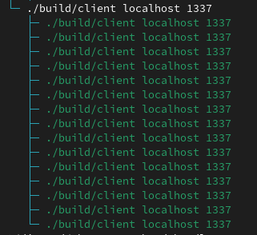
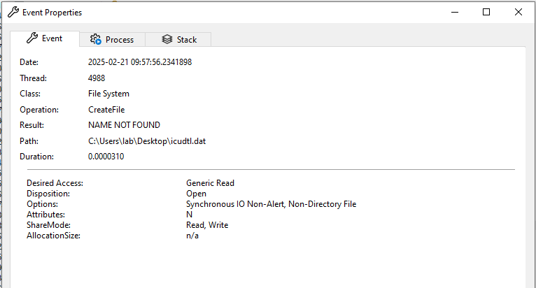

# Detecting implant.js

I've written and collaborated with others to produce lots of different ways of detecting implant.js to try and head off any potential abuse of the platform.

If you write other detections and would like to share them, please send me a PR and feel free to update this README as well to give yourself credit in whatever form you so desire :)

## File-based

I have several YARA signatures [here](rules.yar) that look for various aspects of the compiled code. If you'd like to write other YARA rules and aren't able to get the implant compiled, feel free to reach out, I have IDBs for them.

need to put some bad strings in there in stealthy ways

## Network-based

The [Proofpoint Emerging Threats Team](https://community.emergingthreats.net/) published several signatures to [ET OPEN](http://rules.emergingthreats.net/OPEN_download_instructions.html) to detect use of implant.js over the wire. Massive thank you to Genina Po (@bingohotdog) and Stuart Del Caliz for writing these!

ET rules:
- `2060254 - ET HUNTING implant.js CnC Handshake (HS_SYN)`
- `2060255 - ET MALWARE implant.js Linux Beacon Check-in`
- `2060256 - ET MALWARE implant.js Windows Beacon Check-in`
- `2060257 - ET MALWARE implant.js CnC Handshake (HS_ACK)`
- `2060258 - ET MALWARE implant.js CnC Activity (Client PKT_FETCH for Evil Module)`
- `2060261 - ET MALWARE implant.js CnC Activity (Evil DBG_CMD_* Sent with DebugMode=ON)`
- `2060262 - ET MALWARE implant.js CnC Activity (Evil DBG_CMD_* Sent)`
- `2060263 - ET MALWARE implant.js Activity (DBG_RESP_* with DebugMode=ON)`
- `2060264 - ET MALWARE implant.js CnC Activity (DBG_RESP_* Sent)`

Additionally, a [PCAP](implantjs_traffic.pcap) is available to show what the protocol looks like over the wire for folks to write their own signatures.

## Host-based

I don't have any host-based signatures currently available, but am working on some Sigma rules to publish.

On linux, several child processes are spawned with the same argv, could maybe be interesting. Linux process tree:

The process tree on Windows is less interesting. However, I have a capture of the process behavior from ProcMon [here](client_startup.pml), where I launched the implant, waited a few seconds, and then tasked it to run the [`whoami`](/modules/whoami.js) module. One possible detection idea is to look for non-browser things trying to load `icudtl.dat` and it failing:

